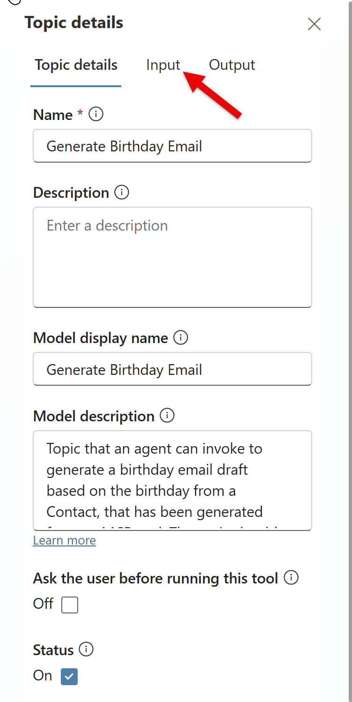
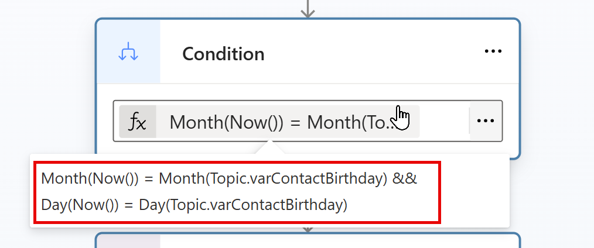

# Lab 4 - Using Power Fx in Copilot Studio

In this lab, we will look at how Power Fx can be used within the context of [Copilot Studio](https://learn.microsoft.com/en-us/microsoft-copilot-studio/fundamentals-what-is-copilot-studio) and [custom AI Builder prompts](https://learn.microsoft.com/en-us/ai-builder/prompts-overview).

## Scenario

It has been six months since you deployed your Power Apps solution to manage Contacts within Wingtip Toys. The business has been very happy with the solution, but they are now more actively exploring generative AI capabilities and how these can be integrated into the solution you built.

You have identified that a good starting point would be to build a custom AI agent using Copilot Studio that can answer questions about the Contacts stored in the Dataverse table. In addition, the business would like to generate email drafts to send to Contacts based on their birthday. Using Power Fx, you will be able to not only to detect when it is the contact's current birthday and [set this to a variable value](https://learn.microsoft.com/en-us/microsoft-copilot-studio/advanced-power-fx), but also use [dynamic Power Fx expressions](https://learn.microsoft.com/en-us/ai-builder/add-inputs-prompt#power-fx-input) to identify the current day and provide the contact with some interesting facts relating to their birthday. Power Fx will be a key component in allowing us to achieve all of this, and more.

## Instructions

In this lab, you will do the following:

- Create a custom AI agent using Copilot Studio.
- Add a custom topic that can manually generate an email draft to send to a Contact, based on their birthday.
- Create a custom prompt that can be orchestrated from the topic created above, to handle the email draft generation.
- Finalise the topic configuration by taking the email draft and sending it (for the purposes of this lab, we will send the email to our own account).
- Test agent and custom prompt, before publishing into the demo website.

This lab will take approximately 30 minutes to complete.

## Exercise 1: Create a Custom AI Agent

1. Navigate to the [Power Apps Maker Portal](https://make.powerapps.com) and, if not already selected, navigate to the developer environment you created in Lab 0:
   
    

2. Click on **Solutions** from the left-hand navigation menu and then click on the **Wingtip Toys PP Solution** solution you created in Lab 0:

    

3. In the solution view, click on **+ New**, select **Agent** and then **Agent**:

    

4. Copilot Studio will open in a new browser tab. If a **Welcome to Copilot Studio** dialog appears, click on **Skip**. 

    

5. On the **Start building your agent** page, click on **Configure**:

    

6. Enter the following details and then click on **Create**:
    - Name: `Contact Management Agent`
    - Description: `Agent to help sales people manage contacts within the organization.`
    - Instructions: `You are an agent designed to assist with queries relating to Contacts in the organization. You provide responses based on the knowledge sources you have access to. If a question relates to an unrelated topic, you will politely, but firmly, refuse to answer. Hallucinations will not be tolerated.`

    

7. After a few moments, the agent will be created and you will be taken to the **Overview** page.

    

8. It's not possible to add Dataverse as a knowledge source when creating the agent, so we will add this next. Click on **Knowledge** and then **+ Add knowledge**:

    

9. On the **Add knowledge** page, select **Dataverse**:

    

10. Select the **Contact** table and then click on **Add to agent**:

    

11. Verify that the Contact table has been added as a knowledge source:

    

12. Let's test the agent. If the **Test your agent** pane is not already open, click on **Test**. Then, click on the **Refresh** icon to ensure the latest knowledge is loaded. In the text input box, enter the following question and then press **Enter** or click on the **Send** icon:

    ```
    How many contacts are stored in the system?
    ```

    

13. After a few moments, the agent should respond with an answer based on the data stored in the Contact table. The response you receive may differ from the below example:

    

14. Experiment with asking a few more questions about the Contacts stored in the Dataverse table to see how the agent responds. Here are some example questions you can try:
    - List the top 5 Contacts whose name begins with the letter 'B'.
    - What is the email address of the contact named 'Adlai Mcall'?
    - How many contacts were created in the last 30 days?

15. Leave the **Contact Management Agent** open if you plan to continue to Exercise 2. Otherwise, you can close the browser tab.

## Exercise 2: Add a Custom Topic

1. If you closed the **Contact Management Agent** in Exercise 1, navigate back to the [Power Apps Maker Portal](https://make.powerapps.com), open the **Wingtip Toys PP Solution** solution and then open the **Contact Management Agent**.

2. On the **Contact Management Agent** page, click on **Topics** and then **+ Add a topic** -> **From blank**:

    

3. Rename the new topic to `Generate Birthday Email`:

    

4. Provide a description for the topic in the **Describe what the topic does** input:

    ```
    Topic that an agent can invoke to generate a birthday email draft based on the birthday from a Contact, that has been generated from an MCP tool. The topic should also be triggered if no birthday is found for the requested Contact.
    ```

    

5. Click on **Save** to save your changes so far:

    

6. Click on the **+** icon underneath the trigger, select **Add a tool**, click **Tool** and then select **Add a tool**:

    

7. In the **Add a tool** pane, select **Model Context Protocol** and then click on **Dataverse MCP Server**:

    

8. If a connection is not automatically created, click the chevron and then select **Create new connection**. Login using your lab environment credentials. Once a connection has been successfully established, click on **Add to agent**:

    

9. Verify that the tool was successfully added to your agent:

    

10. With our topic, knowledge sources and MCP server defined, the topic will successfully trigger, but we need a mechanism to feed in two key information points - the name and the birthday of the Contact. We will configure two input variables to support this. On the **Generate Birthday Email** topic page, click on the **Details** icon:

    

11. On the **Topic details** pane, click on **Input**:

    

12. Click on **Create a new variable**:

    
    
13. Configure the input variable as follows. You may need to expand the **Additional settings** section to see all options:
    - **Variable name**: `varContactBirthday`
    - **Variable data type**: Select **Date**
    - **Identify as**: Select **Date**
    - **Description**: `The birthday of the Contact.`
    - **Should prompt user**: Uncheck

    

14. Repeat steps 12-13 to create a second input variable with the following configuration:
    - **Variable name**: `varContactName`
    - **Variable data type**: Select **String**
    - **Identify as**: Select **Person name**
    - **Description**: `The full name of the Contact from Dataverse.`
    - **Should prompt user**: Uncheck

    

15. Close the **Topic details** pane by clicking on the **X** in the top-right corner.

    

16. Click on **Save** to save your changes so far.
17. On the designer page for the **Generate Birthday Email** topic, click on the **+** icon under the trigger and then select **Add a condition**:

    

18. When we imported the Contact data in an earlier lab, several Contacts _without_ birthdays were imported. We need to configure the condition to accomodate this scenario, using the Power Fx **IsBlank()** function. On the newly added condition, click on the elipses (...) and then select **Change to formula**.

    

19. On the **Enter or select a value** input, click the elipses (...) icon and then select **Formula**:

    

20. In the formula bar, enter the following formula and then click on **Insert**:

    ```
    !IsBlank(Topic.varContactBirthday)
    ```
    

21. Verify that the condition has been successfully updated:

    

22. Under the **All other conditions** branch, click on the **+** icon and then select **Send a message**:

    

23. In the **Send a message** action, enter the following message:

    ```
    Hmmm, it seems we don't have a birthday for {Topic.varContactName}​... 😢
    ```

    

> [!TIP]
> You may need to click away into the designer pane for the message node to recognize the Power Fx expression and for your screen to resemble the above screenshot.

24. Click on the final **+** icon at the bottom of both branches, select **Topic management** and then **End current topic**:

    

25. Your topic should resemble the screenshot below. Click on **Save** to save your changes so far.

    

26. Under the condition that checks the birthday is not blank, click on the **+** icon and then select **Send a message**.

    

27. In the **Send a message** action, enter the following message:

    ```
    Great! {Topic.varContactName}'s birthday is 
    {Text(Topic.varContactBirthday, DateTimeFormat.LongDate)}​. Let's see if that's today...
    ```

    

> [!TIP]
> You may need to click away into the designer pane for the message node to recognize the Power Fx expression and for your screen to resemble the above screenshot.

28. Click on the **+** icon below the message node created in the previous step and then select **Add a condition**:

    

29. Click on the elipses (...) on the newly created condition and then select **Change to formula**.
30. Click on the elipses (...) icon on the **Enter or select a value** input and then select **Formula**.
31. In the formula bar, enter the following formula and then click on **Insert**:

    ```
    Month(Now()) = Month(Topic.varContactBirthday) && Day(Now()) = Day(Topic.varContactBirthday)
    ```

    

32. Verify that the condition has been successfully updated:

    

33. Under the **All other conditions** branch, click on the **+** icon and then select **Send a message**.
34. In the **Send a message** action, enter the following message:

    ```
    Today is {Text(Now(), "dd mmmm")}​, which isn't {Topic.varContactName}'s birthday. Come back again when it's {Text(Topic.varContactBirthday, "dd mmmm")}​!
    ```

    

> [!TIP]
> You may need to click away into the designer pane for the message node to recognize the Power Fx expression and for your screen to resemble the above screenshot.

35. Click on the **+** icon under the condition defined in step 30 and then select **Send a message**.
36. In the **Send a message** action, enter the following message:

    ```
    Wonderful! Then today is the perfect day to send them an email 🥳 Give me a moment...
    ```
    
    

37. Verify that your topic now resembles the screenshot below. Click on **Save** to save your changes so far.

    

38. Leave the topic designer open, as we will continue working with it in Exercise 3.

## Exercise 3: Create a Custom Prompt

TBC

## Exercise 4: Finalise Topic Configuration

TBC

## Exercise 5: Test the AI Agent

TBC

**Congratulations, you've finished Lab 4** 🥳