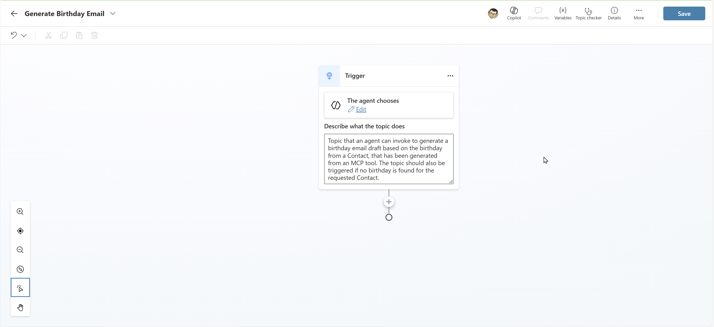

# Lab 4 - Using Power Fx in Copilot Studio

In this lab, we will look at how Power Fx can be used within the context of [Copilot Studio](https://learn.microsoft.com/en-us/microsoft-copilot-studio/fundamentals-what-is-copilot-studio) and [custom AI Builder prompts](https://learn.microsoft.com/en-us/ai-builder/prompts-overview).

## Scenario

It has been six months since you deployed your Power Apps solution to manage Contacts within Wingtip Toys. The business has been very happy with the solution, but they are now more actively exploring generative AI capabilities and how these can be integrated into the solution you built.

You have identified that a good starting point would be to build a custom AI agent using Copilot Studio that can answer questions about the Contacts stored in the Dataverse table. In addition, the business would like to automatically generate email drafts to send to Contacts based on their birthday. Using Power Fx, you will be able to not only to detect when it is the contact's current birthday and [set this to a variable value](https://learn.microsoft.com/en-us/microsoft-copilot-studio/advanced-power-fx), but also use [dynamic Power Fx expressions](https://learn.microsoft.com/en-us/ai-builder/add-inputs-prompt#power-fx-input) to identify the current day and provide the contact with a fun fact relating to their birthday.

## Instructions

In this lab, you will do the following:

- Create a custom AI agent using Copilot Studio.
- Add a custom topic that can manually generate an email draft to send to a Contact, based on their birthday.
- Create a custom prompt that can be orchestrated from the topic created above, to handle the email draft generation.
- Implement the orchestration of the custom prompt, based on a defined schedule.
- Test the new AI agent and custom prompt.

This lab will take approximately 30 minutes to complete.

## Exercise 1: Create a Custom AI Agent

1. Navigate to the [Power Apps Maker Portal](https://make.powerapps.com) and, if not already selected, navigate to the developer environment you created in Lab 0:
   
    

2. Click on **Solutions** from the left-hand navigation menu and then click on the **Wingtip Toys PP Solution** solution you created in Lab 0:

    

3. In the solution view, click on **+ New**, select **Agent** and then **Agent**:

    

4. Copilot Studio will open in a new browser tab. If a **Welcome to Copilot Studio** dialog appears, click on **Skip**. 

    

5. On the **Start building your agent** page, click on **Configure**:

    

6. Enter the following details and then click on **Create**:
    - Name: `Contact Management Agent`
    - Description: `Agent to help sales people manage contacts within the organization.`
    - Instructions: `You are an agent designed to assist with queries relating to Contacts in the organization. You provide responses based on the knowledge sources you have access to. If a question relates to an unrelated topic, you will politely, but firmly, refuse to answer. Hallucinations will not be tolerated.`

    

7. After a few moments, the agent will be created and you will be taken to the **Overview** page.

    

8. It's not possible to add Dataverse as a knowledge source when creating the agent, so we will add this next. Click on **Knowledge** and then **+ Add knowledge**:

    

9. On the **Add knowledge** page, select **Dataverse**:

    

10. Select the **Contact** table and then click on **Add to agent**:

    

11. Verify that the Contact table has been added as a knowledge source:

    

12. Let's test the agent. If the **Test your agent** pane is not already open, click on **Test**. Then, click on the **Refresh** icon to ensure the latest knowledge is loaded. In the text input box, enter the following question and then press **Enter** or click on the **Send** icon:

    ```
    How many contacts are stored in the system?
    ```

    

13. After a few moments, the agent should respond with an answer based on the data stored in the Contact table. The response you receive may differ from the below example:

    

14. Leave the **Contact Management Agent** open if you plan to continue to Exercise 2. Otherwise, you can close the browser tab.

## Exercise 2: Add a Custom Topic

1. If you closed the **Contact Management Agent** in Exercise 1, navigate back to the [Power Apps Maker Portal](https://make.powerapps.com), open the **Wingtip Toys PP Solution** solution and then open the **Contact Management Agent**.

2. On the **Contact Management Agent** page, click on **Topics** and then **+ Add a topic** -> **From blank**:

    

3. Rename the new topic to `Generate Birthday Email`:

    

4. Provide a description for the topic in the **Describe what the topic does** input:

    ```
    Topic that users can invoke to generate a birthday email draft for a contact, containing a fun fact about their birthday.
    ```

    

5. Click on **Save** to save your changes so far:

    

TBC

## Exercise 3: Create a Custom Prompt

TBC

## Exercise 4: Configure Agent Orchestration

TBC

## Exercise 5: Test the AI Agent

TBC

**Congratulations, you've finished Lab 4** 🥳